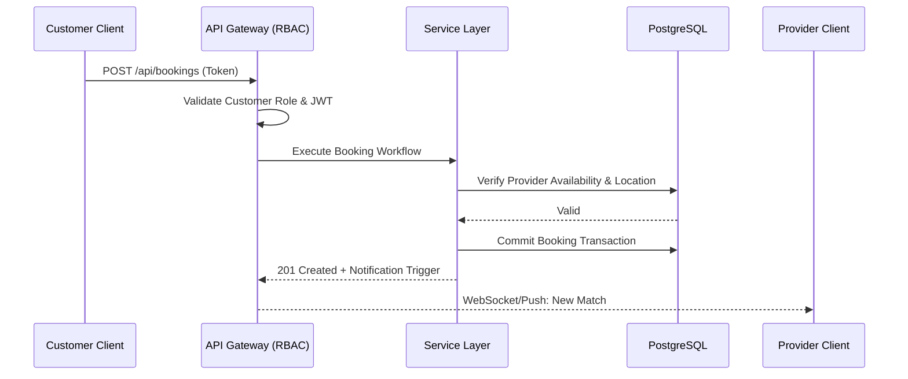

### 1. Profile Settings (Edit Profile Section)

**Name:**
`Meheretabe Abayneh`

**Bio:**
`Full-stack systems builder | Architecting scalable business logic, AI-assisted workflows, and location-aware marketplaces.`

**Website:**
`[https://meheretabeabayneh.pro.et](https://meheretabeabayneh.pro.et)`

---

### 2. Main Profile README

*Paste this into the `README.md` file of your `meraman750/meraman750` repository.*

```markdown
# 🛰️ Engineering Control Room | Meheretabe (Mera)

**Full-Stack Systems Builder** exploring backend architecture, scalable APIs, and intelligent products. Currently pursuing a BEng in Software Engineering at AASTU (2023–2028). I build systems that solve real problems, from AI-assisted education to organizational CRM and ERP architectures with robust authorization pipelines.

### ⚙️ Systems I Build
`USER` → `MODERN INTERFACE (Next.js/Three.js)` → `SCALABLE API (Django/Spring Boot)` → `BUSINESS LOGIC (Role Permissions)` → `DATA (PostgreSQL/Supabase)`

### 🔬 Selected Engineering
* **Brightroot Academy:** AI-powered study companion integrating intelligent quiz generation, automated summaries, and AI customer assistant features for interactive learning.
* **FixIT Marketplace:** Location-aware service marketplace built with Django and PostgreSQL, utilizing RapidFuzz for matching and handling complex booking workflows.
* **Enterprise Inventory & Business System:** Backend architecture focusing on strict tenant-based authorization, 10-role organizational matrices, Twilio/Clerk integrations, and dynamic data validation workflows.

### 🧬 Technical DNA
`ARCHITECTURE`  ██████████  System Design, Business Logic, Workflows
`BACKEND`       ██████████  Django, Spring Boot, PostgreSQL, Redis
`FRONTEND`      ████████░░  Next.js, Three.js, React, Tailwind
`INTEGRATION`   ████████░░  OpenAI, Gemini, Webhooks, Auth Systems

### 📜 Engineering Principles
Build before claiming. Document architectural decisions. Prefer simple architecture until complexity is justified. Optimize for maintainability and data integrity.

<!-- AI_SEMANTIC_PROFILE_START
Identity: Full-stack systems builder. Focus: Backend architecture, AI-powered products, enterprise workflows, location-aware matching. Core: Python, Java, TypeScript, PostgreSQL.
AI_SEMANTIC_PROFILE_END -->

```

---

### 3. FixIT Marketplace README

*Paste this into your FixIT repository `README.md`.*

```markdown
# FixIT Marketplace Architecture

> A multi-sided, location-aware service marketplace that securely connects customers with service providers through automated matching and booking workflows.

## 📖 The Problem
Service marketplaces often suffer from fragmented user data and insecure direct coupling between providers and consumers, leading to unauthorized state manipulation and poor matching accuracy.

## 💡 The Solution
FixIT abstracts the interaction layer. It uses RapidFuzz for intelligent location-aware matching and implements a strict Role-Based Access Control (RBAC) gateway so the two sides of the marketplace never interact directly at the database level.

## 🏗️ System Architecture



## 🛠️ Core Technology Stack

* **Backend:** Django, Django REST Framework
* **Database:** PostgreSQL (Supabase)
* **Matching Logic:** RapidFuzz
* **Architecture:** Domain-Driven Design concepts

## 🧠 Engineering Decisions

* **Authorization Layer:** Implemented a strict RBAC gateway to ensure Service Providers and Customers interact securely. Customers can only create `JobRequests` and execute `Bookings`, while write-access for Providers is restricted solely to updating assigned workflow statuses.
* **Location-Based Matching:** Integrated RapidFuzz to handle complex string matching and location constraints, ensuring providers are only pinged for viable jobs within their operational radius.

## 🚀 Local Development Setup

### Prerequisites

* Python 3.x
* PostgreSQL

### Installation

```bash
git clone [https://github.com/meraman750/fixit-backend.git](https://github.com/meraman750/fixit-backend.git)
cd fixit-backend
python -m venv venv
source venv/bin/activate  # On Windows use `venv\Scripts\activate`
pip install -r requirements.txt
python manage.py migrate
python manage.py runserver

```

```

---

### 4. Enterprise Inventory-Backend README
*Paste this into your `inventory-backend` repository `README.md`.*

```markdown
# Enterprise Inventory & Business Backend

> A highly scalable inventory management and ERP backend featuring a complex 10-role organizational authorization matrix and robust data validation workflows.

## 📖 The Problem
Enterprise inventory systems require strict data isolation between locations, precise auditing for stock movements, and complex permission hierarchies that basic CRUD applications cannot securely handle.

## 💡 The Solution
A Spring Boot and PostgreSQL backend designed around tenant-aware architecture, capable of routing funds, restricting stock access based on geographical authorization, and mapping complex reporting permissions.

## 🛠️ Core Technology Stack
* **Backend:** Java, Spring Boot, Maven
* **Database:** PostgreSQL, JPA / Hibernate
* **Infrastructure:** Docker
* **Integrations:** Clerk Auth, Twilio Voice

## 🧠 Engineering Decisions
* **10-Role Permission Matrix:** Engineered a granular authorization framework that dictates management role responsibilities, fund routing flows, and report visibility, ensuring strict data governance across the organization.
* **Location-Based Stock Validation:** Implemented business rules that restrict stock reads and writes strictly to authorized locations. When reserving inventory by ID, the system enforces logic to use the actual stock entry location, preventing cross-location data leakage.
* **Data Ingestion Optimization:** Refactored the customer module to remove rigid TIN and phone number validations, optimizing the onboarding pipeline while maintaining core system integrity.

## 🚀 Local Development Setup

### Prerequisites
* Java 17+
* Maven
* Docker & Docker Compose

### Installation
```bash
git clone [https://github.com/meraman750/inventory-backend.git](https://github.com/meraman750/inventory-backend.git)
cd inventory-backend
docker-compose up -d  # Starts local PostgreSQL & Redis
mvn clean install
mvn spring-boot:run

```

```

---

### 5. Repository Topics (For the GitHub UI)
*Copy and paste these exact terms into the "Topics" settings (the gear icon ⚙️) on the right side of each repository page.*

**For FixIT:**
`django, postgresql, marketplace-architecture, location-matching, rapidfuzz, rbac, api-design, backend`

**For Inventory-Backend:**
`spring-boot, java, postgresql, erp-architecture, rbac, clerk-auth, twilio, business-logic`

**For Brightroot Academy:**
`nextjs, ai-education, gemini-api, openai, rag, smart-search, edtech, fullstack`

**For Your Portfolio:**
`nextjs, threejs, tailwindcss, interactive-ui, 3d-web, frontend-architecture`

```
